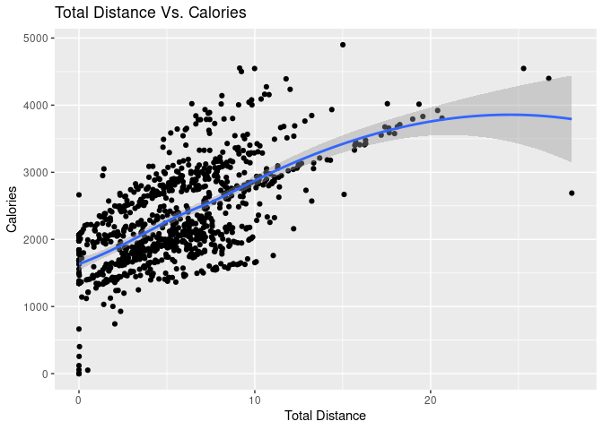
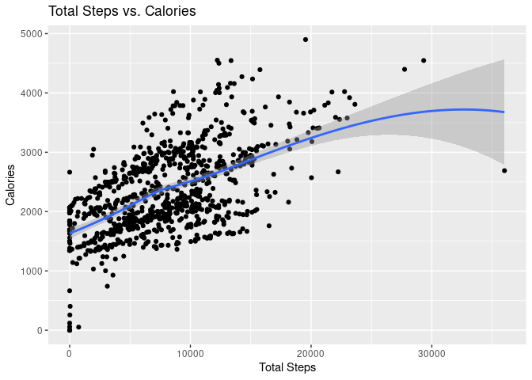
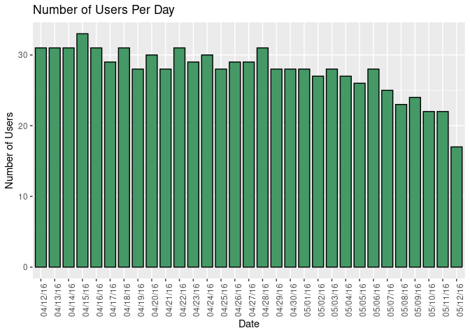
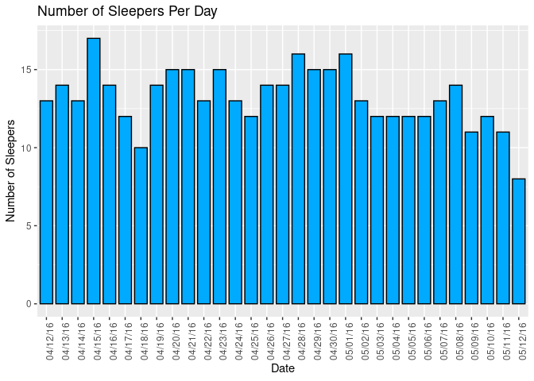
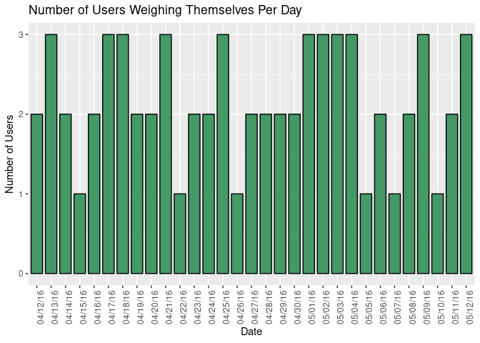
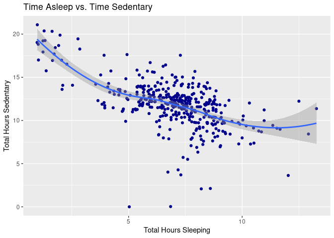
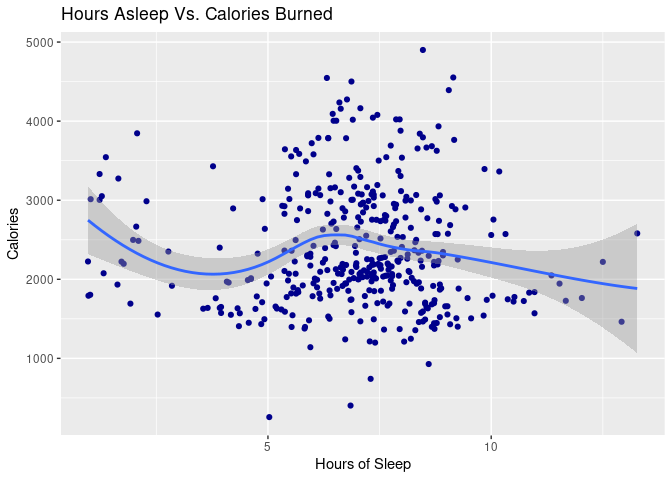

Bellabeat Case Study
================
Michael Budetti

# Preface

This analysis is a case study created for the Google Analytics
Professional Certification course on [Coursera.](www.coursera.com) This
is my very first case study I have done for the purpose of beginning an
online portfolio; therefore, if you have any comments or suggestions for
me, I would gladly welcome them in the comments. My plan for this case
study is to go through the entire process using R. For fruther cases, I
will use different approaches. I appreciate you for taking the time to
read this, and I hope you enjoy!

------------------------------------------------------------------------

# Introduction

Bellabeat is a high-tech company that manufactures smart products with a
focus on health. Founded in 2013 by Urška Sršen and Sando Mur,
Bellabeat, while still a small company, has gorwn rapidly and has
positioned itself to be a potentially key manufacterer in the future.

Bellabeat has four products:

**Bellabeat app:** Provides users with health data related to sleep,
activity, stress, mindfullness habits, and menstrual cycles. This app
connects to their line of smart wellness products.

**Leaf:** classic wellness tracker that can be worn as a bracelet,
necklace, or clip. It connects to the Bellabeat app to track activity,
sleep, and stress.

**Time:** wellness watch that combines the timeless look of a classic
timepiece with smart technology to track user activity, sleep, and
stress. It connects with the Bellabeat app to provide insights to daily
wellness.

**Spring:** Water bottle that tracks daily water intake using smart
technology to ensure adequete water consumption through the day. It
connects to the bellabeat app to track hydration levels.

------------------------------------------------------------------------

# Business Task

I have been asked to analyze the usage data related to the Bellabeat
suite of products to gain insights into how these consumers use
non-Bellabeat smart devices. I then will choose one Bellabeat product to
apply these insights to. These questions will guide my analysis:

1.  What are some trends in smart device usage?

2.  How could these trends apply to Bellabeat customers?

3.  How could these trends help influence Bellabeat marketing strategy?

------------------------------------------------------------------------

# Data Description

The data used in this project is public via The data was made available
through [Möbius](https://www.kaggle.com/arashnic), the license is CC0:
Public Domain, and the data itself can be found via
[Kaggle.](https://www.kaggle.com/arashnic/fitbit). The Kaggle page’s
data description is as follows:

“These datasets were generated by respondents to a distributed survey
via Amazon Mechanical Turk between 03.12.2016-05.12.2016. Thirty
eligible Fitbit users consented to the submission of personal tracker
data, including minute-level output for physical activity, heart rate,
and sleep monitoring.”

In addition to the categories stated, the data also includes steps
taken, calories burned, and METs with data sets measuring by day, hour,
minute, and one heart rate data set measuring in seconds.

------------------------------------------------------------------------

# Processing Data

As previously stated, there are 18 total .csv files, many of which
contain data on an hour, minute, and even second basis respectively, I
do not believe the data set that measures in seconds would be worthwhile
to use in our analysis, so I am omitting it from this process.

Let us first upload all relevant datasets, then look at the dataset
related to users’ daily activity as this overall data will give us a
good overall understanding of what variables we are working with, and to
confirm how big the sample size is.

``` r
install.packages("tidyverse")
```

    ## Installing package into '/cloud/lib/x86_64-pc-linux-gnu-library/4.1'
    ## (as 'lib' is unspecified)

``` r
install.packages("lubridate")
```

    ## Installing package into '/cloud/lib/x86_64-pc-linux-gnu-library/4.1'
    ## (as 'lib' is unspecified)

``` r
library(tidyverse)
```

    ## ── Attaching packages ─────────────────────────────────────── tidyverse 1.3.1 ──

    ## ✓ ggplot2 3.3.5     ✓ purrr   0.3.4
    ## ✓ tibble  3.1.4     ✓ dplyr   1.0.7
    ## ✓ tidyr   1.1.3     ✓ stringr 1.4.0
    ## ✓ readr   2.0.1     ✓ forcats 0.5.1

    ## ── Conflicts ────────────────────────────────────────── tidyverse_conflicts() ──
    ## x dplyr::filter() masks stats::filter()
    ## x dplyr::lag()    masks stats::lag()

``` r
library(lubridate)
```

    ## 
    ## Attaching package: 'lubridate'

    ## The following objects are masked from 'package:base':
    ## 
    ##     date, intersect, setdiff, union

``` r
activity <- read_csv("dailyActivity_merged.csv")
```

    ## Rows: 940 Columns: 15

    ## ── Column specification ────────────────────────────────────────────────────────
    ## Delimiter: ","
    ## chr  (1): ActivityDate
    ## dbl (14): Id, TotalSteps, TotalDistance, TrackerDistance, LoggedActivitiesDi...

    ## 
    ## ℹ Use `spec()` to retrieve the full column specification for this data.
    ## ℹ Specify the column types or set `show_col_types = FALSE` to quiet this message.

``` r
calories <- read_csv("dailyCalories_merged.csv")
```

    ## Rows: 940 Columns: 3

    ## ── Column specification ────────────────────────────────────────────────────────
    ## Delimiter: ","
    ## chr (1): ActivityDay
    ## dbl (2): Id, Calories

    ## 
    ## ℹ Use `spec()` to retrieve the full column specification for this data.
    ## ℹ Specify the column types or set `show_col_types = FALSE` to quiet this message.

``` r
intensities <- read_csv("dailyIntensities_merged.csv")
```

    ## Rows: 940 Columns: 10

    ## ── Column specification ────────────────────────────────────────────────────────
    ## Delimiter: ","
    ## chr (1): ActivityDay
    ## dbl (9): Id, SedentaryMinutes, LightlyActiveMinutes, FairlyActiveMinutes, Ve...

    ## 
    ## ℹ Use `spec()` to retrieve the full column specification for this data.
    ## ℹ Specify the column types or set `show_col_types = FALSE` to quiet this message.

``` r
steps <- read_csv("dailySteps_merged.csv")
```

    ## Rows: 940 Columns: 3

    ## ── Column specification ────────────────────────────────────────────────────────
    ## Delimiter: ","
    ## chr (1): ActivityDay
    ## dbl (2): Id, StepTotal

    ## 
    ## ℹ Use `spec()` to retrieve the full column specification for this data.
    ## ℹ Specify the column types or set `show_col_types = FALSE` to quiet this message.

``` r
sleep <- read_csv("sleepDay_merged.csv")
```

    ## Rows: 413 Columns: 5

    ## ── Column specification ────────────────────────────────────────────────────────
    ## Delimiter: ","
    ## chr (1): SleepDay
    ## dbl (4): Id, TotalSleepRecords, TotalMinutesAsleep, TotalTimeInBed

    ## 
    ## ℹ Use `spec()` to retrieve the full column specification for this data.
    ## ℹ Specify the column types or set `show_col_types = FALSE` to quiet this message.

``` r
weight_log <- read_csv("weightLogInfo_merged.csv")
```

    ## Rows: 67 Columns: 8

    ## ── Column specification ────────────────────────────────────────────────────────
    ## Delimiter: ","
    ## chr (1): Date
    ## dbl (6): Id, WeightKg, WeightPounds, Fat, BMI, LogId
    ## lgl (1): IsManualReport

    ## 
    ## ℹ Use `spec()` to retrieve the full column specification for this data.
    ## ℹ Specify the column types or set `show_col_types = FALSE` to quiet this message.

``` r
head(activity)
```

    ## # A tibble: 6 × 15
    ##           Id ActivityDate TotalSteps TotalDistance TrackerDistance LoggedActivitie…
    ##        <dbl> <chr>             <dbl>         <dbl>           <dbl>            <dbl>
    ## 1 1503960366 4/12/2016         13162          8.5             8.5                 0
    ## 2 1503960366 4/13/2016         10735          6.97            6.97                0
    ## 3 1503960366 4/14/2016         10460          6.74            6.74                0
    ## 4 1503960366 4/15/2016          9762          6.28            6.28                0
    ## 5 1503960366 4/16/2016         12669          8.16            8.16                0
    ## 6 1503960366 4/17/2016          9705          6.48            6.48                0
    ## # … with 9 more variables: VeryActiveDistance <dbl>,
    ## #   ModeratelyActiveDistance <dbl>, LightActiveDistance <dbl>,
    ## #   SedentaryActiveDistance <dbl>, VeryActiveMinutes <dbl>,
    ## #   FairlyActiveMinutes <dbl>, LightlyActiveMinutes <dbl>,
    ## #   SedentaryMinutes <dbl>, Calories <dbl>

``` r
length(unique(activity$Id))
```

    ## [1] 33

When we preview the data, we can see that a lot of the columns contain
information relating to steps taken, calories burned, and various levels
of intensity. We can assume this daily activity data set contains the
same information as the daily calories, daily intensities, and daily
steps data sets inside of it. However, to be sure, we are going to still
upload these data sets and compare them.

At the second observation we can see that there are 33 unique Ids in
total, meaning there are 33 women that this study used as a sample, 3
more than the 30 that we were told are in the survey. Some data is
better than no data, and it will definitely be a good starting point;
however, a larger more robust sample size would have benefited this
analysis greatly.

A third observation is that this data does not include the user’s age or
height. While this may be because of privacy restrictions of the study
itself or the privacy contract of Bellabeat, this sort of data would be
very useful in order to draw more in-depth conclusions on the people
included in this study.

Going forward I will compare the multiple daily datasets to the activity
to see if our assumption is correct.

``` r
colnames(calories)
```

    ## [1] "Id"          "ActivityDay" "Calories"

``` r
colnames(intensities)
```

    ##  [1] "Id"                       "ActivityDay"             
    ##  [3] "SedentaryMinutes"         "LightlyActiveMinutes"    
    ##  [5] "FairlyActiveMinutes"      "VeryActiveMinutes"       
    ##  [7] "SedentaryActiveDistance"  "LightActiveDistance"     
    ##  [9] "ModeratelyActiveDistance" "VeryActiveDistance"

``` r
colnames(steps)
```

    ## [1] "Id"          "ActivityDay" "StepTotal"

``` r
colnames(sleep)
```

    ## [1] "Id"                 "SleepDay"           "TotalSleepRecords" 
    ## [4] "TotalMinutesAsleep" "TotalTimeInBed"

``` r
colnames(weight_log)
```

    ## [1] "Id"             "Date"           "WeightKg"       "WeightPounds"  
    ## [5] "Fat"            "BMI"            "IsManualReport" "LogId"

``` r
length(unique(calories$Id))
```

    ## [1] 33

``` r
length(unique(intensities$Id))
```

    ## [1] 33

``` r
length(unique(steps$Id))
```

    ## [1] 33

``` r
length(unique(sleep$Id))
```

    ## [1] 24

``` r
length(unique(weight_log$Id))
```

    ## [1] 8

``` r
dim(activity)
```

    ## [1] 940  15

``` r
dim(calories)
```

    ## [1] 940   3

``` r
dim(intensities)
```

    ## [1] 940  10

``` r
dim(steps)
```

    ## [1] 940   3

``` r
dim(sleep)
```

    ## [1] 413   5

``` r
dim(weight_log)
```

    ## [1] 67  8

``` r
summary(activity)
```

    ##        Id            ActivityDate         TotalSteps    TotalDistance   
    ##  Min.   :1.504e+09   Length:940         Min.   :    0   Min.   : 0.000  
    ##  1st Qu.:2.320e+09   Class :character   1st Qu.: 3790   1st Qu.: 2.620  
    ##  Median :4.445e+09   Mode  :character   Median : 7406   Median : 5.245  
    ##  Mean   :4.855e+09                      Mean   : 7638   Mean   : 5.490  
    ##  3rd Qu.:6.962e+09                      3rd Qu.:10727   3rd Qu.: 7.713  
    ##  Max.   :8.878e+09                      Max.   :36019   Max.   :28.030  
    ##  TrackerDistance  LoggedActivitiesDistance VeryActiveDistance
    ##  Min.   : 0.000   Min.   :0.0000           Min.   : 0.000    
    ##  1st Qu.: 2.620   1st Qu.:0.0000           1st Qu.: 0.000    
    ##  Median : 5.245   Median :0.0000           Median : 0.210    
    ##  Mean   : 5.475   Mean   :0.1082           Mean   : 1.503    
    ##  3rd Qu.: 7.710   3rd Qu.:0.0000           3rd Qu.: 2.053    
    ##  Max.   :28.030   Max.   :4.9421           Max.   :21.920    
    ##  ModeratelyActiveDistance LightActiveDistance SedentaryActiveDistance
    ##  Min.   :0.0000           Min.   : 0.000      Min.   :0.000000       
    ##  1st Qu.:0.0000           1st Qu.: 1.945      1st Qu.:0.000000       
    ##  Median :0.2400           Median : 3.365      Median :0.000000       
    ##  Mean   :0.5675           Mean   : 3.341      Mean   :0.001606       
    ##  3rd Qu.:0.8000           3rd Qu.: 4.782      3rd Qu.:0.000000       
    ##  Max.   :6.4800           Max.   :10.710      Max.   :0.110000       
    ##  VeryActiveMinutes FairlyActiveMinutes LightlyActiveMinutes SedentaryMinutes
    ##  Min.   :  0.00    Min.   :  0.00      Min.   :  0.0        Min.   :   0.0  
    ##  1st Qu.:  0.00    1st Qu.:  0.00      1st Qu.:127.0        1st Qu.: 729.8  
    ##  Median :  4.00    Median :  6.00      Median :199.0        Median :1057.5  
    ##  Mean   : 21.16    Mean   : 13.56      Mean   :192.8        Mean   : 991.2  
    ##  3rd Qu.: 32.00    3rd Qu.: 19.00      3rd Qu.:264.0        3rd Qu.:1229.5  
    ##  Max.   :210.00    Max.   :143.00      Max.   :518.0        Max.   :1440.0  
    ##     Calories   
    ##  Min.   :   0  
    ##  1st Qu.:1828  
    ##  Median :2134  
    ##  Mean   :2304  
    ##  3rd Qu.:2793  
    ##  Max.   :4900

``` r
summary(calories)
```

    ##        Id            ActivityDay           Calories   
    ##  Min.   :1.504e+09   Length:940         Min.   :   0  
    ##  1st Qu.:2.320e+09   Class :character   1st Qu.:1828  
    ##  Median :4.445e+09   Mode  :character   Median :2134  
    ##  Mean   :4.855e+09                      Mean   :2304  
    ##  3rd Qu.:6.962e+09                      3rd Qu.:2793  
    ##  Max.   :8.878e+09                      Max.   :4900

``` r
summary(intensities)
```

    ##        Id            ActivityDay        SedentaryMinutes LightlyActiveMinutes
    ##  Min.   :1.504e+09   Length:940         Min.   :   0.0   Min.   :  0.0       
    ##  1st Qu.:2.320e+09   Class :character   1st Qu.: 729.8   1st Qu.:127.0       
    ##  Median :4.445e+09   Mode  :character   Median :1057.5   Median :199.0       
    ##  Mean   :4.855e+09                      Mean   : 991.2   Mean   :192.8       
    ##  3rd Qu.:6.962e+09                      3rd Qu.:1229.5   3rd Qu.:264.0       
    ##  Max.   :8.878e+09                      Max.   :1440.0   Max.   :518.0       
    ##  FairlyActiveMinutes VeryActiveMinutes SedentaryActiveDistance
    ##  Min.   :  0.00      Min.   :  0.00    Min.   :0.000000       
    ##  1st Qu.:  0.00      1st Qu.:  0.00    1st Qu.:0.000000       
    ##  Median :  6.00      Median :  4.00    Median :0.000000       
    ##  Mean   : 13.56      Mean   : 21.16    Mean   :0.001606       
    ##  3rd Qu.: 19.00      3rd Qu.: 32.00    3rd Qu.:0.000000       
    ##  Max.   :143.00      Max.   :210.00    Max.   :0.110000       
    ##  LightActiveDistance ModeratelyActiveDistance VeryActiveDistance
    ##  Min.   : 0.000      Min.   :0.0000           Min.   : 0.000    
    ##  1st Qu.: 1.945      1st Qu.:0.0000           1st Qu.: 0.000    
    ##  Median : 3.365      Median :0.2400           Median : 0.210    
    ##  Mean   : 3.341      Mean   :0.5675           Mean   : 1.503    
    ##  3rd Qu.: 4.782      3rd Qu.:0.8000           3rd Qu.: 2.053    
    ##  Max.   :10.710      Max.   :6.4800           Max.   :21.920

``` r
summary(steps)
```

    ##        Id            ActivityDay          StepTotal    
    ##  Min.   :1.504e+09   Length:940         Min.   :    0  
    ##  1st Qu.:2.320e+09   Class :character   1st Qu.: 3790  
    ##  Median :4.445e+09   Mode  :character   Median : 7406  
    ##  Mean   :4.855e+09                      Mean   : 7638  
    ##  3rd Qu.:6.962e+09                      3rd Qu.:10727  
    ##  Max.   :8.878e+09                      Max.   :36019

``` r
summary(sleep)
```

    ##        Id              SleepDay         TotalSleepRecords TotalMinutesAsleep
    ##  Min.   :1.504e+09   Length:413         Min.   :1.000     Min.   : 58.0     
    ##  1st Qu.:3.977e+09   Class :character   1st Qu.:1.000     1st Qu.:361.0     
    ##  Median :4.703e+09   Mode  :character   Median :1.000     Median :433.0     
    ##  Mean   :5.001e+09                      Mean   :1.119     Mean   :419.5     
    ##  3rd Qu.:6.962e+09                      3rd Qu.:1.000     3rd Qu.:490.0     
    ##  Max.   :8.792e+09                      Max.   :3.000     Max.   :796.0     
    ##  TotalTimeInBed 
    ##  Min.   : 61.0  
    ##  1st Qu.:403.0  
    ##  Median :463.0  
    ##  Mean   :458.6  
    ##  3rd Qu.:526.0  
    ##  Max.   :961.0

``` r
summary(weight_log)
```

    ##        Id                Date              WeightKg       WeightPounds  
    ##  Min.   :1.504e+09   Length:67          Min.   : 52.60   Min.   :116.0  
    ##  1st Qu.:6.962e+09   Class :character   1st Qu.: 61.40   1st Qu.:135.4  
    ##  Median :6.962e+09   Mode  :character   Median : 62.50   Median :137.8  
    ##  Mean   :7.009e+09                      Mean   : 72.04   Mean   :158.8  
    ##  3rd Qu.:8.878e+09                      3rd Qu.: 85.05   3rd Qu.:187.5  
    ##  Max.   :8.878e+09                      Max.   :133.50   Max.   :294.3  
    ##                                                                         
    ##       Fat             BMI        IsManualReport      LogId          
    ##  Min.   :22.00   Min.   :21.45   Mode :logical   Min.   :1.460e+12  
    ##  1st Qu.:22.75   1st Qu.:23.96   FALSE:26        1st Qu.:1.461e+12  
    ##  Median :23.50   Median :24.39   TRUE :41        Median :1.462e+12  
    ##  Mean   :23.50   Mean   :25.19                   Mean   :1.462e+12  
    ##  3rd Qu.:24.25   3rd Qu.:25.56                   3rd Qu.:1.462e+12  
    ##  Max.   :25.00   Max.   :47.54                   Max.   :1.463e+12  
    ##  NA's   :65

We now can see that our previous assumption is true: the data from data
frames calories, intensities, and steps are all contained within the
activity data frame already. What is also interesting to note is that
the number of unique Ids present in the sleep and weight\_log data sets
are less than the total sample size at 24 and 8 respectively. This
already tells us that there was a problem with the participants
consistently recording their data for these fields and will warrant a
closer investigation later.

------------------------------------------------------------------------

# Cleaning the Data

First I need to check for duplicate rows that could be present in the
data.

``` r
nrow(activity) == nrow(unique(activity))
```

    ## [1] TRUE

``` r
nrow(sleep) == nrow(unique(sleep))
```

    ## [1] FALSE

``` r
nrow(weight_log) == nrow(unique(weight_log))
```

    ## [1] TRUE

Since there are duplicates I can go ahead and remove them.

``` r
nrow(sleep) - nrow(unique(sleep))
```

    ## [1] 3

``` r
sleep <- unique(sleep)
```

Let’s check for any missing values

``` r
sum(is.na(activity))
```

    ## [1] 0

``` r
sum(is.na(sleep))
```

    ## [1] 0

``` r
sum(is.na(weight_log))
```

    ## [1] 65

We can see there are 65 values in the weight\_log data set, so let’s
explore it a little more.

``` r
head(weight_log)
```

    ## # A tibble: 6 × 8
    ##           Id Date      WeightKg WeightPounds   Fat   BMI IsManualReport    LogId
    ##        <dbl> <chr>        <dbl>        <dbl> <dbl> <dbl> <lgl>             <dbl>
    ## 1 1503960366 5/2/2016…     52.6         116.    22  22.6 TRUE            1.46e12
    ## 2 1503960366 5/3/2016…     52.6         116.    NA  22.6 TRUE            1.46e12
    ## 3 1927972279 4/13/201…    134.          294.    NA  47.5 FALSE           1.46e12
    ## 4 2873212765 4/21/201…     56.7         125.    NA  21.5 TRUE            1.46e12
    ## 5 2873212765 5/12/201…     57.3         126.    NA  21.7 TRUE            1.46e12
    ## 6 4319703577 4/17/201…     72.4         160.    25  27.5 TRUE            1.46e12

``` r
sum(is.na(weight_log$Fat))
```

    ## [1] 65

Here we can see that all the null values are contained in the “Fat”
column. There really is no purpose for this column for this case study,
so I will be taking this column out just to avoid any unneeded issues
that may arrise from wokring with null values.

``` r
weight_log <- weight_log %>%
  select(-Fat)
head(weight_log)
```

    ## # A tibble: 6 × 7
    ##           Id Date          WeightKg WeightPounds   BMI IsManualReport      LogId
    ##        <dbl> <chr>            <dbl>        <dbl> <dbl> <lgl>               <dbl>
    ## 1 1503960366 5/2/2016 11:…     52.6         116.  22.6 TRUE              1.46e12
    ## 2 1503960366 5/3/2016 11:…     52.6         116.  22.6 TRUE              1.46e12
    ## 3 1927972279 4/13/2016 1:…    134.          294.  47.5 FALSE             1.46e12
    ## 4 2873212765 4/21/2016 11…     56.7         125.  21.5 TRUE              1.46e12
    ## 5 2873212765 5/12/2016 11…     57.3         126.  21.7 TRUE              1.46e12
    ## 6 4319703577 4/17/2016 11…     72.4         160.  27.5 TRUE              1.46e12

------------------------------------------------------------------------

# Transforming the Data

First I will be adding a new column on both activity and sleep data sets
to translate the current ActivityDate and SleepDay columns into a
specific date formatted column.

``` r
activity$ActivityDate=as.POSIXct(activity$ActivityDate, format="%m/%d/%Y", tz=Sys.timezone())
activity$date <- format(activity$ActivityDate, format = "%m/%d/%y")

sleep$SleepDay=as.POSIXct(sleep$SleepDay, format="%m/%d/%Y %I:%M:%S %p", tz=Sys.timezone())
sleep$date <- format(sleep$SleepDay, format = "%m/%d/%y")

weight_log$Date=as.POSIXct(weight_log$Date, format="%m/%d/%Y %I:%M:%S %p", tz=Sys.timezone())
weight_log$date <- format(weight_log$Date, format = "%m/%d/%y")

head(activity)
```

    ## # A tibble: 6 × 16
    ##           Id ActivityDate        TotalSteps TotalDistance TrackerDistance
    ##        <dbl> <dttm>                   <dbl>         <dbl>           <dbl>
    ## 1 1503960366 2016-04-12 00:00:00      13162          8.5             8.5 
    ## 2 1503960366 2016-04-13 00:00:00      10735          6.97            6.97
    ## 3 1503960366 2016-04-14 00:00:00      10460          6.74            6.74
    ## 4 1503960366 2016-04-15 00:00:00       9762          6.28            6.28
    ## 5 1503960366 2016-04-16 00:00:00      12669          8.16            8.16
    ## 6 1503960366 2016-04-17 00:00:00       9705          6.48            6.48
    ## # … with 11 more variables: LoggedActivitiesDistance <dbl>,
    ## #   VeryActiveDistance <dbl>, ModeratelyActiveDistance <dbl>,
    ## #   LightActiveDistance <dbl>, SedentaryActiveDistance <dbl>,
    ## #   VeryActiveMinutes <dbl>, FairlyActiveMinutes <dbl>,
    ## #   LightlyActiveMinutes <dbl>, SedentaryMinutes <dbl>, Calories <dbl>,
    ## #   date <chr>

``` r
head(sleep)
```

    ## # A tibble: 6 × 6
    ##           Id SleepDay            TotalSleepRecor… TotalMinutesAsl… TotalTimeInBed
    ##        <dbl> <dttm>                         <dbl>            <dbl>          <dbl>
    ## 1 1503960366 2016-04-12 00:00:00                1              327            346
    ## 2 1503960366 2016-04-13 00:00:00                2              384            407
    ## 3 1503960366 2016-04-15 00:00:00                1              412            442
    ## 4 1503960366 2016-04-16 00:00:00                2              340            367
    ## 5 1503960366 2016-04-17 00:00:00                1              700            712
    ## 6 1503960366 2016-04-19 00:00:00                1              304            320
    ## # … with 1 more variable: date <chr>

``` r
head(weight_log)
```

    ## # A tibble: 6 × 8
    ##        Id Date                WeightKg WeightPounds   BMI IsManualReport   LogId
    ##     <dbl> <dttm>                 <dbl>        <dbl> <dbl> <lgl>            <dbl>
    ## 1  1.50e9 2016-05-02 23:59:59     52.6         116.  22.6 TRUE           1.46e12
    ## 2  1.50e9 2016-05-03 23:59:59     52.6         116.  22.6 TRUE           1.46e12
    ## 3  1.93e9 2016-04-13 01:08:52    134.          294.  47.5 FALSE          1.46e12
    ## 4  2.87e9 2016-04-21 23:59:59     56.7         125.  21.5 TRUE           1.46e12
    ## 5  2.87e9 2016-05-12 23:59:59     57.3         126.  21.7 TRUE           1.46e12
    ## 6  4.32e9 2016-04-17 23:59:59     72.4         160.  27.5 TRUE           1.46e12
    ## # … with 1 more variable: date <chr>

Next I will aggregate the data. I added a “TotalActiveMinutes” column to
help us with some calculations later.

``` r
activity_v2 <- activity %>%
  rowwise() %>%
  mutate(TotalActiveMinutes = sum(c(VeryActiveMinutes, FairlyActiveMinutes, LightlyActiveMinutes)))

merged_data <- merge(sleep, activity_v2, by=c("Id", "date"))
```

Now that I have aggregated the data I will compare on a daily basis, I
can now begin the analysis.

------------------------------------------------------------------------

# Analysis:

``` r
ggplot(activity_v2, aes(x=TotalDistance, y = Calories))+
  geom_point() +
  geom_smooth() +
  labs(title="Total Distance Vs. Calories", x= "Total Distance")
```

    ## `geom_smooth()` using method = 'loess' and formula 'y ~ x'

<!-- -->

``` r
ggplot(data=activity_v2, aes(x=TotalSteps, y=Calories)) + 
  geom_point() + geom_smooth() + 
  labs(title="Total Steps vs. Calories", x= "Total Steps")
```

    ## `geom_smooth()` using method = 'loess' and formula 'y ~ x'

<!-- -->

As you can see from the graphs above, there is a positive correlation
between both the steps taken as well as the distance traveled per day
with the amount of calories they burn. If users wanted to more burn more
calories, then they should walk more for longer.

``` r
days_with_activity <- activity_v2 %>%
  filter(TotalSteps != 0)

ggplot(data = days_with_activity, aes(x = date))+
  geom_bar(width=0.8, color="black", fill="#449966")+
  labs(title = "Number of Users Per Day", x = "Date", y = "Number of Users")+
  theme(axis.text.x = element_text(angle = 90))
```

<!-- -->

``` r
ggplot(data = sleep, aes(x = date))+
  geom_bar(width=0.8, color="black", fill="#00AAFF")+
  labs(title = "Number of Sleepers Per Day",
       x = "Date", y = "Number of Sleepers")+
  theme(axis.text.x = element_text(angle = 90))
```

<!-- -->

``` r
ggplot(data = weight_log, aes(x = date))+
  geom_bar(width=0.8, color="black", fill="#449966")+
  labs(title = "Number of Users Weighing Themselves Per Day", x = "Date", y = "Number of Users")+
  theme(axis.text.x = element_text(angle = 90))
```

<!-- -->

Here I am exploring the number of users who recorded their activity per
day versus the number of users who recorded their sleep per day. 33
women participated in this study, yet only 22 of them still used the
product to track activity by the 30th day. On the last day, only 17
still used it for activity tracking purposes. Generally speaking about
half of those that measured their activity also measured their sleep on
any given day. By looking at the number of users who weighed themselves
on any given day, this number is astronomically lower with 3 users being
the max number of users who weighed themselves on any given day of the
week.

``` r
merged_data <- merged_data %>% 
  mutate(TotalHoursActive = round(TotalActiveMinutes/60, 2),
         SedentaryHours = round(SedentaryMinutes/60, 2),
         TotalHoursSleeping = round(TotalMinutesAsleep/60, 2),
         TotalHoursInBed = round(TotalTimeInBed/60, 2))

ggplot(data=merged_data, aes(x=TotalHoursSleeping, y=SedentaryHours)) + 
geom_point(color='darkblue') + geom_smooth() +
  labs(title="Time Asleep vs. Time Sedentary", x= "Total Hours Sleeping", y="Total Hours Sedentary")
```

    ## `geom_smooth()` using method = 'loess' and formula 'y ~ x'

<!-- -->

With this graph we can observe the negative correlation between the the
time spend sedentary and the time spent sleeping. We need more data to
go off of, but if Bellabeat wanted to improve users’ sleep, they can
focus on reducing their users’ sedentary time (which would also increase
calories burned).

``` r
ggplot(data=merged_data, aes(x=TotalHoursSleeping, y=Calories)) + 
geom_point(color='darkblue') + geom_smooth() +
  labs(title="Hours Asleep Vs. Calories Burned", x= "Hours of Sleep")
```

    ## `geom_smooth()` using method = 'loess' and formula 'y ~ x'

<!-- -->

I believe this to be the most interesting graph. Here we can see that
users that get between approximately the 6 to 8 hours of sleep burn more
calories than their counterparts to sleep more and less than this. I
find this to be really interesting, as it suggests that if Bellabeat
wish to improve their ability to burn calories, they should seek to get
the recommended 7-8 hours of sleep per day.

------------------------------------------------------------------------

# Summary:

There is a sharp contrast between how many users use the Bellabeat
products to measure activity as opposed to measuring their sleep. The
daily use while during activities was, while it was only worn by \_
users during sleep on average. While this does make sense, as I doubt
most people would want to wear a watch or a bracket while they sleep, it
does present us with gaps in the data. Besides that, I can only think
that the users might not have even known about the function either.

While I noticed that there are positive correlations between distance
walked/steps taken and calories burned, this is by no means a revelation
and could have been inferred before even starting this project; however,
I do think it is interesting to note that people who slept the
recommended 6-8 hours are more likely to burn more calories on average
than the people who slept over and below this time frame. This coupled
with the data that seems to also show that reducing sedentary time would
increase the hours sleep would suggest that how much sleep users are
getting is just as, if not more, critical to how hard they are working.
It is a variable that is often overlooked when discussing fitness. Since
the amount of users that consistently participated in the sleep portion
of this study was lower than the activity participation, I would take
these results with caution as I believe that more data is necessary. I
do think this is worth investigating though!

------------------------------------------------------------------------

# Recommendations:

1.  Retention seems like the name of the game. As stated previously,
    only 17 out of the initial 33 participants were tracking their data
    by the last day. Users have got to feel like there is a long-term
    benefit with using the product. Not only a long-term benefit, but no
    short-term “costs” either (a good example of one of these costs is
    how the Bellabeat devices might be uncomfortable to wear while
    sleeping for example). Users should want to record their data, so
    Bellabeat should find ways to make it fun. Perhaps a more
    interactive dashboar dwhere people can “level up” and earn points
    after completing fitness challenges.

2.  I believe that a lack of participation in the weight\_log section,
    as well as the absent of participation as the study went on, can be
    accredited to a lack of community. If users were to be grouped with
    others based on similar skill levels, activity, number of steps
    taken, or some other metric. If there was some sort of way that
    users in these groups could anonymously interact and share their
    struggles and successes with similar people, I believe that user
    participation would rise.

3.  Lastly, I believe Bellabeat should focus on trying to improve their
    users’ sleep and their ability to track their sleep. “The Hours
    Asleep Vs. Calories Burned” graph presented us with a interesting
    dynamic that people who get adequate sleep usually burn more
    calories. The lack of data on sleep as opposed to the amount of data
    collected on activity is of major concern. More data on this subject
    needs to be collected going forward. \*\*\*
